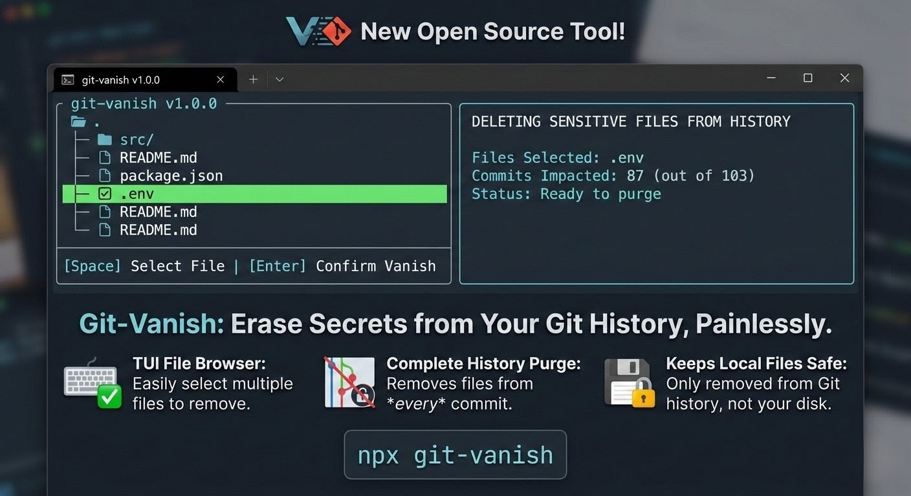

# git-vanish 🔥



> Interactively browse your repo and **permanently vanish a sensitive file from all git commit history** — without deleting your other commits.

## The problem

You `git push`ed a file containing secrets (API keys, passwords, `.env`, `credentials.json`, etc.) to GitHub. Once it's in history, just deleting the file and committing again is **not enough** — the secret is still visible in every past commit.

`git-vanish` surgically removes that file from **every single commit** across all branches and tags, while preserving the rest of your history exactly as it was.

---

## Install globally

```bash
npm install -g git-vanish
```

---

## Usage

Run inside any git repository:

```bash
git-vanish
```

This opens an **interactive terminal file browser** where you can navigate your repo and pick the file to scrub.

### Options

| Flag                | Description                                   |
| ------------------- | --------------------------------------------- |
| `-r, --repo <path>` | Path to git repo (default: current directory) |
| `-f, --file <path>` | Skip browser — provide the file path directly |
| `--dry-run`         | Preview what would happen, no changes made    |
| `--no-gc`           | Skip the aggressive garbage collection step   |
| `-V, --version`     | Show version                                  |
| `-h, --help`        | Show help                                     |

### Examples

```bash
# Interactive file browser
git-vanish

# Vanish a specific file directly
git-vanish --file config/secrets.json

# Preview only (no changes)
git-vanish --dry-run

# Different repo
git-vanish --repo /path/to/my-project
```

---

## Keyboard Controls (file browser)

| Key               | Action                                   |
| ----------------- | ---------------------------------------- |
| `↑` / `↓`         | Navigate up/down                         |
| `→` / `Enter`     | Open directory or quick-select file      |
| `←` / `Backspace` | Go up one directory                      |
| `j` / `k`         | Vim-style up/down                        |
| `Space`           | Toggle file selection (multi-select)     |
| `a`               | Select all tracked files in current view |
| `u`               | Deselect all                             |
| `/`               | Search/filter entries                    |
| `Escape`          | Clear search                             |
| `Page Up/Down`    | Jump one page                            |
| `Home` / `End`    | Jump to first/last                       |
| `q`               | Quit without selecting                   |

---

## What it does (step by step)

1. **Finds your git repo root** (walks up from cwd)
2. **Loads all git-tracked files** — both current and historic
3. **Opens TUI browser** — navigate directories, see only tracked files highlighted
4. **Shows every commit** that ever contained the file
5. **Confirms** with a warning before changing anything
6. **Rewrites history** using `git filter-repo` (if installed) or `git filter-branch` (built into git) — removes the file from every commit
7. **Cleans up** reflogs and runs `git gc --aggressive --prune=now`
8. **Adds the file to `.gitignore`** so it can never be committed again
9. **Prints force-push commands** to update your remote

---

## After running

You **must** force-push to update the remote:

```bash
git push origin --force --all
git push origin --force --tags
```

Then **rotate any leaked secrets immediately** (GitHub and other platforms may cache content in their CDN even after a rewrite).

All collaborators must re-clone or run:

```bash
git fetch --all
git reset --hard origin/<branch>
```

---

## Speed tip — `git filter-repo`

`git-vanish` automatically prefers [`git-filter-repo`](https://github.com/newren/git-filter-repo) if it's installed — it's ~10-50× faster than `filter-branch` on large repos.

```bash
pip install git-filter-repo
# or
brew install git-filter-repo
```

---

## How history rewriting works

```
Before scrub:
  commit A  – adds secret.json ← 🔒 secret visible here
  commit B  – other changes
  commit C  – other changes
  commit D  – deletes secret.json
  commit E  – other changes   ← HEAD (secret STILL in history)

After scrub:
  commit A' – (secret.json never existed)
  commit B' – other changes   (identical diff, different hash)
  commit C' – other changes
  commit D' – (empty commit pruned if nothing else changed)
  commit E' – other changes   ← HEAD (clean history)
```

All other files, diffs, messages, authors, and timestamps are preserved exactly.

---

## Requirements

- Node.js ≥ 14
- Git ≥ 2.x (must be in PATH)

---

## License

MIT
